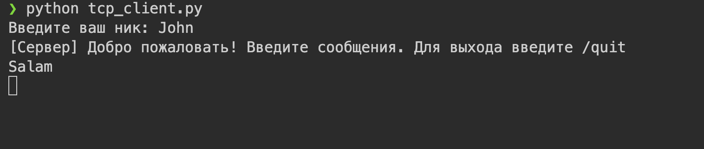

# Задание 4: Многопользовательский чат на TCP

## Условие

Реализовать многопользовательский чат.

_Требования_:

- Обязательно использовать библиотеку `socket`.
- Для многопользовательского чата необходимо использовать библиотеку `threading`.

_Реализация_:

- Протокол TCP: 100% баллов.
- Протокол UDP: 80% баллов.
- Для UDP используйте threading для получения сообщений на клиенте.
- Для TCP запустите клиентские подключения и обработку сообщений от всех пользователей в потоках. Не забудьте сохранять пользователей, чтобы отправлять им сообщения.

## Принцип работы

1. Сервер:

   - запускается и слушает входящие подключения;
   - при подключении нового клиента — создаёт поток для его обработки;
   - хранит список всех подключённых клиентов;
   - пересылает каждое полученное сообщение всем остальным клиентам.

2. Клиент:

   - подключается к серверу;
   - в одном потоке — отправляет сообщения;
   - в другом потоке — принимает сообщения от сервера и отображает их.

3. Работа в реальном времени достигается за счёт потоков, обрабатывающих ввод и вывод параллельно.

## Код программы

### Сервер (tcp_server.py)

```
import socket
import threading

HOST = "0.0.0.0"
PORT = 12345

clients = {}
clients_lock = threading.Lock()


def broadcast(message: str, exclude_sock=None):
    """Отправить message всем клиентам (кроме exclude_sock)."""
    with clients_lock:
        for sock in list(clients.keys()):
            if sock is exclude_sock:
                continue
            try:
                sock.sendall(message.encode("utf-8"))
            except Exception:
                remove_client(sock)


def remove_client(sock):
    with clients_lock:
        nick = clients.pop(sock, None)
    try:
        sock.close()
    except Exception:
        pass
    if nick:
        broadcast(f"[Сервер] Пользователь '{nick}' покинул чат.\n")


def handle_client(conn: socket.socket, addr):
    try:
        conn.sendall("Введите ваш ник: ".encode("utf-8"))
        nick = conn.recv(1024).decode("utf-8").strip()
        if not nick:
            conn.sendall("Неправильный ник, соединение закрывается.\n".encode("utf-8"))
            conn.close()
            return

        with clients_lock:
            clients[conn] = nick

        print(f"[+] {addr} -> {nick} присоединился")
        broadcast(
            f"[Сервер] Пользователь '{nick}' присоединился к чату.\n", exclude_sock=conn
        )
        conn.sendall(
            "[Сервер] Добро пожаловать! Введите сообщения. Для выхода введите /quit\n".encode(
                "utf-8"
            )
        )

        while True:
            data = conn.recv(4096)
            if not data:
                break
            text = data.decode("utf-8").rstrip("\n")
            if text == "/quit":
                break
            message = f"{nick}: {text}\n"
            print(message.strip())
            broadcast(message, exclude_sock=conn)

    except ConnectionResetError:
        pass
    except Exception as e:
        print("Ошибка в обработчике клиента:", e)
    finally:
        remove_client(conn)
        print(f"[-] {addr} отключился")


def accept_loop(server_sock: socket.socket):
    while True:
        conn, addr = server_sock.accept()
        thread = threading.Thread(target=handle_client, args=(conn, addr), daemon=True)
        thread.start()


if __name__ == "__main__":
    with socket.socket(socket.AF_INET, socket.SOCK_STREAM) as server_sock:
        server_sock.setsockopt(socket.SOL_SOCKET, socket.SO_REUSEADDR, 1)
        server_sock.bind((HOST, PORT))
        server_sock.listen()
        print(f"Сервер чата запущен на {HOST}:{PORT}")
        try:
            accept_loop(server_sock)
        except KeyboardInterrupt:
            print("\nСервер остановлен вручную.")
```

### Клиент (tcp_client.py)

```
import socket
import threading
import sys

HOST = "127.0.0.1"
PORT = 12345


def receive_loop(sock: socket.socket):
    try:
        while True:
            data = sock.recv(4096)
            if not data:
                print("Соединение с сервером разорвано.")
                break
            print(data.decode("utf-8"), end="")
    except Exception:
        pass
    finally:
        try:
            sock.close()
        except Exception:
            pass
        sys.exit(0)


if __name__ == "__main__":
    with socket.socket(socket.AF_INET, socket.SOCK_STREAM) as sock:
        try:
            sock.connect((HOST, PORT))
        except Exception as e:
            print("Не удалось подключиться:", e)
            sys.exit(1)

        initial = sock.recv(1024).decode("utf-8")
        print(initial, end="")
        nick = input().strip()
        sock.sendall((nick + "\n").encode("utf-8"))

        recv_thread = threading.Thread(target=receive_loop, args=(sock,), daemon=True)
        recv_thread.start()

        try:
            while True:
                msg = input()
                if msg.strip() == "/quit":
                    sock.sendall("/quit\n".encode("utf-8"))
                    break
                try:
                    sock.sendall((msg + "\n").encode("utf-8"))
                except Exception:
                    print("Ошибка отправки — соединение потеряно.")
                    break
        except KeyboardInterrupt:
            sock.sendall("/quit\n".encode("utf-8"))
        finally:
            try:
                sock.close()
            except Exception:
                pass
            print("Вы вышли из чата.")
            sys.exit(0)
```

## Запуск

1. Необходимо открыть два терминала.
2. В первом запустить сервер:
   `python tcp_server.py`
3. В других трёх терминалах запустить клиент:
   `python tcp_client.py`
4. Для каждого клиента введите имя.
5. Можно набирать сообщения.

## Результат

Запустив сервер, видим: 

Запускаем трёх клиентов. Набираем сообщения.

Терминал первого клиента:


Терминал второго клиента:


Терминал третьего клиента:


Сообщения пользователя отображаются в терминалах других клиентов, но не в его.

## Выводы

1. Реализован многопользовательский чат с использованием `socket`, `threading` и TCP.
2. Сервер поддерживает несколько одновременных подключений, обрабатывая каждого клиента в отдельном потоке.
3. Сообщения корректно доставляются между всеми клиентами в реальном времени.
